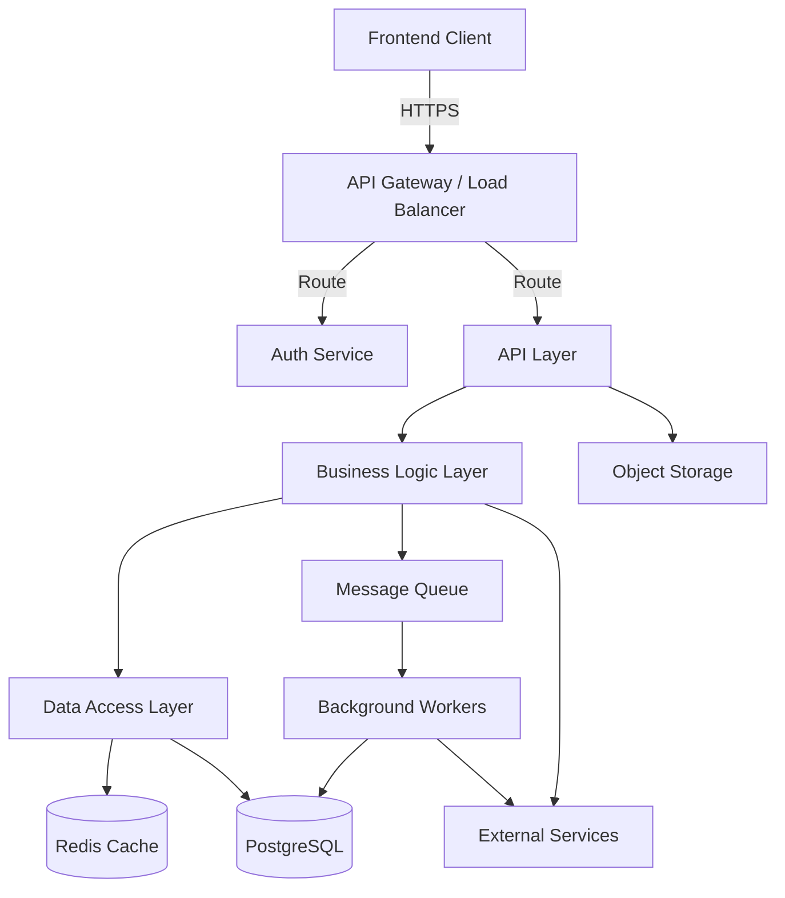
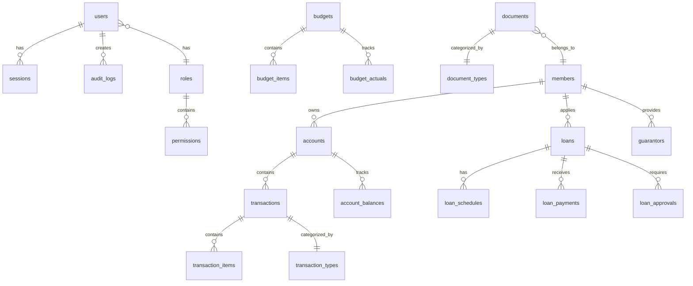
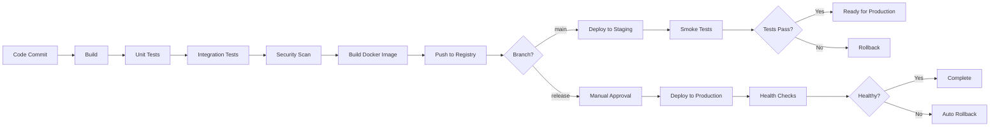

# Enterprise Backend Infrastructure Design

## Overview

This design document outlines the architecture for a production-ready enterprise backend system for the MSME FinTech solution. The system follows a microservices-inspired modular monolith architecture using Node.js/TypeScript with Express.js, PostgreSQL database, Redis caching, and modern DevOps practices. The design prioritizes scalability, security, maintainability, and operational excellence.

### Technology Stack

- **Runtime**: Node.js 20 LTS with TypeScript 5.x
- **API Framework**: Express.js with TypeScript decorators
- **Database**: PostgreSQL 16 with TimescaleDB extension for time-series data
- **ORM**: Prisma for type-safe database access
- **Cache**: Redis 7.x for session storage and caching
- **Message Queue**: BullMQ with Redis for background jobs
- **Authentication**: JWT with refresh tokens, Passport.js for strategies
- **Validation**: Zod for runtime type validation
- **Testing**: Jest for unit tests, Supertest for API tests
- **Documentation**: OpenAPI 3.1 with Swagger UI
- **Monitoring**: Prometheus metrics, Winston logging, OpenTelemetry tracing
- **Deployment**: Docker containers, Kubernetes orchestration

## Architecture

### High-Level Architecture



### Layered Architecture

The system follows a clean architecture pattern with clear separation of concerns:

1. **Presentation Layer** (API Controllers)
   - HTTP request/response handling
   - Input validation and sanitization
   - Response formatting
   - Error handling middleware

2. **Business Logic Layer** (Services)
   - Core business rules and workflows
   - Transaction orchestration
   - Calculation engine
   - Workflow engine

3. **Data Access Layer** (Repositories)
   - Database queries and mutations
   - Cache management
   - Data mapping and transformation

4. **Infrastructure Layer**
   - External service integrations
   - File storage
   - Email service
   - Message queue

## Components and Interfaces

### 1. API Gateway and Routing

**Purpose**: Entry point for all client requests with routing, authentication, and rate limiting.

**Key Components**:
- Express.js application with middleware pipeline
- Helmet.js for security headers
- CORS configuration
- Rate limiting with express-rate-limit
- Request logging and correlation IDs
- API versioning support

**Interface**:
```typescript
interface APIGatewayConfig {
  port: number;
  corsOrigins: string[];
  rateLimits: {
    windowMs: number;
    maxRequests: number;
  };
  apiVersion: string;
}

interface RequestContext {
  correlationId: string;
  userId?: string;
  userRole?: string;
  ipAddress: string;
  timestamp: Date;
}
```

### 2. Authentication and Authorization Module

**Purpose**: Handle user authentication, session management, and access control.

**Key Components**:
- JWT token generation and validation
- Refresh token rotation
- Password hashing with bcrypt
- Multi-factor authentication (TOTP)
- Role-based access control (RBAC)
- Permission checking middleware

**Interface**:
```typescript
interface AuthService {
  login(credentials: LoginCredentials): Promise<AuthTokens>;
  refreshToken(refreshToken: string): Promise<AuthTokens>;
  logout(userId: string): Promise<void>;
  verifyMFA(userId: string, code: string): Promise<boolean>;
  changePassword(userId: string, oldPassword: string, newPassword: string): Promise<void>;
}

interface AuthTokens {
  accessToken: string;
  refreshToken: string;
  expiresIn: number;
}

interface Permission {
  resource: string;
  action: 'create' | 'read' | 'update' | 'delete';
  conditions?: Record<string, any>;
}

interface RBACService {
  checkPermission(userId: string, permission: Permission): Promise<boolean>;
  getUserRoles(userId: string): Promise<string[]>;
  assignRole(userId: string, role: string): Promise<void>;
}
```

### 3. Database Layer

**Purpose**: Provide type-safe database access with connection pooling and query optimization.

**Schema Design**:



**Key Tables**:
- users, roles, permissions, sessions
- members, accounts, transactions, account_balances
- loans, loan_schedules, loan_payments, loan_approvals, guarantors
- budgets, budget_items, budget_actuals
- documents, document_versions
- audit_logs, system_logs
- configurations, workflows, notifications

**Interface**:
```typescript
interface Repository<T> {
  findById(id: string): Promise<T | null>;
  findMany(filter: Filter<T>): Promise<T[]>;
  create(data: CreateInput<T>): Promise<T>;
  update(id: string, data: UpdateInput<T>): Promise<T>;
  delete(id: string): Promise<void>;
  count(filter: Filter<T>): Promise<number>;
}

interface TransactionManager {
  executeInTransaction<R>(
    callback: (tx: Transaction) => Promise<R>
  ): Promise<R>;
}
```

### 4. Calculation Engine

**Purpose**: Perform accurate financial calculations for loans, interest, and analytics.

**Key Components**:
- Loan amortization calculator (reducing balance, flat rate)
- Interest accrual engine
- Aging analysis calculator
- Cash flow forecasting
- Budget variance calculator
- Financial ratio calculator

**Interface**:
```typescript
interface CalculationEngine {
  calculateLoanSchedule(params: LoanParams): Promise<LoanSchedule[]>;
  calculateInterestAccrual(accountId: string, date: Date): Promise<Decimal>;
  calculateAgingAnalysis(accountType: 'AR' | 'AP', asOfDate: Date): Promise<AgingReport>;
  forecastCashFlow(startDate: Date, endDate: Date, scenarios: Scenario[]): Promise<CashFlowForecast>;
  calculateBudgetVariance(budgetId: string, period: Period): Promise<VarianceAnalysis>;
}

interface LoanParams {
  principal: Decimal;
  interestRate: Decimal;
  termMonths: number;
  method: 'reducing_balance' | 'flat_rate';
  startDate: Date;
  paymentFrequency: 'monthly' | 'quarterly';
}

interface LoanSchedule {
  paymentNumber: number;
  dueDate: Date;
  principal: Decimal;
  interest: Decimal;
  totalPayment: Decimal;
  balance: Decimal;
}
```

### 5. Workflow Engine

**Purpose**: Automate approval workflows, scheduled tasks, and business process automation.

**Key Components**:
- Workflow definition engine
- State machine for workflow execution
- Approval routing logic
- Notification dispatcher
- Scheduled task executor (cron jobs)

**Interface**:
```typescript
interface WorkflowEngine {
  startWorkflow(workflowType: string, context: WorkflowContext): Promise<WorkflowInstance>;
  approveStep(workflowId: string, stepId: string, approverId: string): Promise<void>;
  rejectStep(workflowId: string, stepId: string, approverId: string, reason: string): Promise<void>;
  getWorkflowStatus(workflowId: string): Promise<WorkflowStatus>;
}

interface WorkflowDefinition {
  id: string;
  name: string;
  steps: WorkflowStep[];
  rules: WorkflowRule[];
}

interface WorkflowStep {
  id: string;
  name: string;
  type: 'approval' | 'notification' | 'calculation' | 'integration';
  approvers?: ApproverConfig;
  nextSteps: string[];
  timeout?: number;
}

interface WorkflowContext {
  entityType: string;
  entityId: string;
  initiatorId: string;
  data: Record<string, any>;
}
```

### 6. Integration Layer

**Purpose**: Connect to external services including banks, payment processors, and accounting systems.

**Key Components**:
- Bank API connectors (NIBSS, Interswitch)
- Payment gateway integrations (Paystack, Flutterwave)
- Webhook receiver and validator
- Retry mechanism with exponential backoff
- Integration monitoring and alerting

**Interface**:
```typescript
interface IntegrationService {
  connectBank(bankCode: string, credentials: BankCredentials): Promise<BankConnection>;
  fetchBankTransactions(connectionId: string, startDate: Date, endDate: Date): Promise<BankTransaction[]>;
  initiatePayment(payment: PaymentRequest): Promise<PaymentResponse>;
  processWebhook(provider: string, payload: any, signature: string): Promise<void>;
}

interface BankTransaction {
  externalId: string;
  date: Date;
  description: string;
  amount: Decimal;
  type: 'credit' | 'debit';
  balance: Decimal;
  reference: string;
}

interface PaymentRequest {
  amount: Decimal;
  currency: string;
  recipient: PaymentRecipient;
  reference: string;
  metadata?: Record<string, any>;
}
```

### 7. Caching Layer

**Purpose**: Improve performance by caching frequently accessed data.

**Caching Strategy**:
- **Session Cache**: User sessions and JWT tokens (TTL: 24 hours)
- **Reference Data**: Roles, permissions, configurations (TTL: 1 hour)
- **Query Results**: Dashboard metrics, reports (TTL: 5 minutes)
- **Computed Values**: Account balances, loan summaries (TTL: 1 minute)

**Interface**:
```typescript
interface CacheService {
  get<T>(key: string): Promise<T | null>;
  set<T>(key: string, value: T, ttl?: number): Promise<void>;
  delete(key: string): Promise<void>;
  invalidatePattern(pattern: string): Promise<void>;
  getOrSet<T>(key: string, factory: () => Promise<T>, ttl?: number): Promise<T>;
}
```

### 8. Background Job Processing

**Purpose**: Handle asynchronous tasks without blocking API requests.

**Job Types**:
- Report generation
- Bulk data imports/exports
- Email notifications
- Interest posting
- Recurring transactions
- Data synchronization

**Interface**:
```typescript
interface JobQueue {
  addJob<T>(queueName: string, jobData: T, options?: JobOptions): Promise<Job<T>>;
  processJob<T>(queueName: string, processor: JobProcessor<T>): void;
  getJobStatus(jobId: string): Promise<JobStatus>;
  retryJob(jobId: string): Promise<void>;
}

interface JobOptions {
  priority?: number;
  delay?: number;
  attempts?: number;
  backoff?: BackoffStrategy;
}

interface JobProcessor<T> {
  (job: Job<T>): Promise<void>;
}
```

### 9. File Storage Service

**Purpose**: Manage document uploads and secure file storage.

**Key Components**:
- S3-compatible object storage integration
- File upload validation (type, size, virus scan)
- Signed URL generation for secure downloads
- File versioning
- Thumbnail generation for images

**Interface**:
```typescript
interface FileStorageService {
  uploadFile(file: FileUpload, metadata: FileMetadata): Promise<StoredFile>;
  downloadFile(fileId: string): Promise<FileStream>;
  generateSignedUrl(fileId: string, expiresIn: number): Promise<string>;
  deleteFile(fileId: string): Promise<void>;
  listVersions(fileId: string): Promise<FileVersion[]>;
}

interface FileUpload {
  buffer: Buffer;
  originalName: string;
  mimeType: string;
  size: number;
}

interface StoredFile {
  id: string;
  url: string;
  key: string;
  size: number;
  mimeType: string;
  uploadedAt: Date;
}
```

### 10. Notification Service

**Purpose**: Send email, SMS, and push notifications to users.

**Key Components**:
- Email template engine (Handlebars)
- SMTP integration (SendGrid, AWS SES)
- SMS gateway integration
- Push notification service (Firebase Cloud Messaging)
- Notification preferences management

**Interface**:
```typescript
interface NotificationService {
  sendEmail(to: string, template: string, data: any): Promise<void>;
  sendSMS(to: string, message: string): Promise<void>;
  sendPushNotification(userId: string, notification: PushNotification): Promise<void>;
  sendBulkNotifications(recipients: string[], notification: Notification): Promise<void>;
}

interface PushNotification {
  title: string;
  body: string;
  data?: Record<string, any>;
  icon?: string;
  badge?: number;
}
```

## Data Models

### Core Entities

```typescript
// User and Authentication
interface User {
  id: string;
  email: string;
  passwordHash: string;
  firstName: string;
  lastName: string;
  roleId: string;
  mfaEnabled: boolean;
  mfaSecret?: string;
  lastLoginAt?: Date;
  createdAt: Date;
  updatedAt: Date;
}

// Member Management
interface Member {
  id: string;
  memberNumber: string;
  firstName: string;
  lastName: string;
  email: string;
  phone: string;
  dateOfBirth: Date;
  address: Address;
  kycStatus: 'pending' | 'verified' | 'rejected';
  kycDocuments: string[];
  joinDate: Date;
  status: 'active' | 'inactive' | 'suspended';
  branchId: string;
  createdAt: Date;
  updatedAt: Date;
}

// Account Management
interface Account {
  id: string;
  accountNumber: string;
  memberId: string;
  accountType: 'savings' | 'current' | 'fixed_deposit';
  currency: string;
  balance: Decimal;
  availableBalance: Decimal;
  interestRate: Decimal;
  status: 'active' | 'dormant' | 'closed';
  openedAt: Date;
  closedAt?: Date;
  createdAt: Date;
  updatedAt: Date;
}

// Transaction Management
interface Transaction {
  id: string;
  transactionNumber: string;
  accountId: string;
  type: 'debit' | 'credit';
  amount: Decimal;
  currency: string;
  description: string;
  reference: string;
  category: string;
  status: 'pending' | 'completed' | 'failed' | 'reversed';
  postedAt?: Date;
  createdBy: string;
  approvedBy?: string;
  metadata: Record<string, any>;
  createdAt: Date;
  updatedAt: Date;
}

// Loan Management
interface Loan {
  id: string;
  loanNumber: string;
  memberId: string;
  productId: string;
  principal: Decimal;
  interestRate: Decimal;
  termMonths: number;
  method: 'reducing_balance' | 'flat_rate';
  purpose: string;
  status: 'pending' | 'approved' | 'disbursed' | 'active' | 'closed' | 'defaulted';
  applicationDate: Date;
  approvalDate?: Date;
  disbursementDate?: Date;
  maturityDate?: Date;
  outstandingBalance: Decimal;
  createdAt: Date;
  updatedAt: Date;
}

// Budget Management
interface Budget {
  id: string;
  name: string;
  fiscalYear: number;
  startDate: Date;
  endDate: Date;
  totalAmount: Decimal;
  status: 'draft' | 'approved' | 'active' | 'closed';
  branchId?: string;
  createdBy: string;
  approvedBy?: string;
  createdAt: Date;
  updatedAt: Date;
}

// Document Management
interface Document {
  id: string;
  name: string;
  description?: string;
  fileId: string;
  fileSize: number;
  mimeType: string;
  category: string;
  entityType: string;
  entityId: string;
  version: number;
  uploadedBy: string;
  tags: string[];
  metadata: Record<string, any>;
  createdAt: Date;
  updatedAt: Date;
}
```

## Error Handling

### Error Classification

```typescript
enum ErrorCode {
  // Client Errors (4xx)
  BAD_REQUEST = 'BAD_REQUEST',
  UNAUTHORIZED = 'UNAUTHORIZED',
  FORBIDDEN = 'FORBIDDEN',
  NOT_FOUND = 'NOT_FOUND',
  CONFLICT = 'CONFLICT',
  VALIDATION_ERROR = 'VALIDATION_ERROR',
  RATE_LIMIT_EXCEEDED = 'RATE_LIMIT_EXCEEDED',
  
  // Server Errors (5xx)
  INTERNAL_ERROR = 'INTERNAL_ERROR',
  DATABASE_ERROR = 'DATABASE_ERROR',
  EXTERNAL_SERVICE_ERROR = 'EXTERNAL_SERVICE_ERROR',
  CALCULATION_ERROR = 'CALCULATION_ERROR',
}

interface APIError {
  code: ErrorCode;
  message: string;
  details?: any;
  timestamp: Date;
  path: string;
  correlationId: string;
}
```

### Error Handling Strategy

1. **Validation Errors**: Return 400 with detailed field-level errors
2. **Authentication Errors**: Return 401 with clear authentication requirements
3. **Authorization Errors**: Return 403 with permission details
4. **Not Found Errors**: Return 404 with resource information
5. **Business Logic Errors**: Return 422 with business rule violations
6. **Server Errors**: Return 500 with correlation ID for tracking
7. **External Service Errors**: Retry with exponential backoff, fallback to cached data

### Global Error Handler

```typescript
interface ErrorHandler {
  handleError(error: Error, context: RequestContext): APIError;
  logError(error: Error, context: RequestContext): void;
  notifyOnCriticalError(error: Error): void;
}
```

## Testing Strategy

### Test Pyramid

1. **Unit Tests** (70% coverage target)
   - Business logic functions
   - Calculation engine
   - Utility functions
   - Validators

2. **Integration Tests** (20% coverage target)
   - API endpoints with database
   - Repository layer
   - External service integrations
   - Workflow engine

3. **End-to-End Tests** (10% coverage target)
   - Critical user journeys
   - Multi-step workflows
   - Payment processing
   - Report generation

### Test Infrastructure

```typescript
// Test Database Setup
interface TestDatabase {
  setup(): Promise<void>;
  teardown(): Promise<void>;
  seed(data: SeedData): Promise<void>;
  reset(): Promise<void>;
}

// Mock Services
interface MockFactory {
  createMockAuthService(): AuthService;
  createMockPaymentGateway(): PaymentGateway;
  createMockEmailService(): EmailService;
}

// Test Fixtures
interface FixtureFactory {
  createUser(overrides?: Partial<User>): User;
  createMember(overrides?: Partial<Member>): Member;
  createLoan(overrides?: Partial<Loan>): Loan;
  createTransaction(overrides?: Partial<Transaction>): Transaction;
}
```

### Performance Testing

- Load testing with k6 or Artillery
- Target: 1000 requests/second with p95 latency < 200ms
- Database query performance monitoring
- Memory leak detection
- Connection pool optimization

## Security Considerations

### Authentication Security

- JWT tokens with short expiration (15 minutes)
- Refresh tokens with rotation
- Secure token storage (httpOnly cookies)
- MFA enforcement for sensitive operations
- Account lockout after failed attempts

### Authorization Security

- Principle of least privilege
- Role-based access control
- Resource-level permissions
- Audit logging for all access

### Data Security

- TLS 1.3 for all communications
- AES-256 encryption for sensitive data
- Password hashing with bcrypt (work factor 12)
- SQL injection prevention (parameterized queries)
- XSS prevention (input sanitization)
- CSRF protection (tokens)

### API Security

- Rate limiting per user/IP
- Request size limits
- Input validation with Zod
- Output encoding
- Security headers (Helmet.js)
- API key rotation

### Infrastructure Security

- Network segmentation
- Firewall rules
- VPC isolation
- Secrets management (AWS Secrets Manager)
- Regular security updates
- Vulnerability scanning

## Deployment Architecture

### Container Strategy

```dockerfile
# Multi-stage build for optimized images
FROM node:20-alpine AS builder
WORKDIR /app
COPY package*.json ./
RUN npm ci
COPY . .
RUN npm run build

FROM node:20-alpine
WORKDIR /app
COPY --from=builder /app/dist ./dist
COPY --from=builder /app/node_modules ./node_modules
EXPOSE 3000
CMD ["node", "dist/server.js"]
```

### Kubernetes Deployment

```yaml
apiVersion: apps/v1
kind: Deployment
metadata:
  name: fintech-api
spec:
  replicas: 3
  selector:
    matchLabels:
      app: fintech-api
  template:
    metadata:
      labels:
        app: fintech-api
    spec:
      containers:
      - name: api
        image: fintech-api:latest
        ports:
        - containerPort: 3000
        env:
        - name: DATABASE_URL
          valueFrom:
            secretKeyRef:
              name: db-credentials
              key: url
        resources:
          requests:
            memory: "512Mi"
            cpu: "500m"
          limits:
            memory: "1Gi"
            cpu: "1000m"
        livenessProbe:
          httpGet:
            path: /health
            port: 3000
          initialDelaySeconds: 30
          periodSeconds: 10
        readinessProbe:
          httpGet:
            path: /ready
            port: 3000
          initialDelaySeconds: 5
          periodSeconds: 5
```

### Environment Configuration

- **Development**: Local Docker Compose setup
- **Staging**: Kubernetes cluster with reduced resources
- **Production**: Multi-zone Kubernetes cluster with auto-scaling

### CI/CD Pipeline



## Monitoring and Observability

### Metrics Collection

```typescript
interface MetricsCollector {
  recordRequestDuration(endpoint: string, duration: number): void;
  recordRequestCount(endpoint: string, statusCode: number): void;
  recordDatabaseQueryDuration(query: string, duration: number): void;
  recordCacheHitRate(operation: string, hit: boolean): void;
  recordQueueSize(queueName: string, size: number): void;
}
```

### Key Metrics

- Request rate (requests/second)
- Error rate (errors/total requests)
- Response time (p50, p95, p99)
- Database connection pool usage
- Cache hit rate
- Queue depth
- Active user sessions
- Background job success rate

### Logging Strategy

```typescript
interface Logger {
  debug(message: string, context?: any): void;
  info(message: string, context?: any): void;
  warn(message: string, context?: any): void;
  error(message: string, error: Error, context?: any): void;
}

// Structured logging format
interface LogEntry {
  timestamp: Date;
  level: 'debug' | 'info' | 'warn' | 'error';
  message: string;
  correlationId: string;
  userId?: string;
  context?: any;
  error?: {
    name: string;
    message: string;
    stack: string;
  };
}
```

### Alerting Rules

- Error rate > 5% for 5 minutes
- Response time p95 > 500ms for 5 minutes
- Database connection pool > 80% for 5 minutes
- Queue depth > 10000 for 10 minutes
- Failed background jobs > 10 in 5 minutes
- Disk usage > 85%
- Memory usage > 90%

## Performance Optimization

### Database Optimization

- Connection pooling (min: 10, max: 50)
- Query optimization with EXPLAIN ANALYZE
- Proper indexing strategy
- Materialized views for complex reports
- Partitioning for large tables (transactions, audit logs)
- Read replicas for reporting queries

### Caching Strategy

- Cache-aside pattern for read-heavy operations
- Write-through caching for critical data
- Cache warming on application startup
- Intelligent cache invalidation
- Distributed caching with Redis Cluster

### API Optimization

- Response compression (gzip)
- Pagination for list endpoints
- Field selection (sparse fieldsets)
- Batch endpoints for bulk operations
- HTTP/2 support
- CDN for static assets

### Background Job Optimization

- Job prioritization
- Batch processing for bulk operations
- Parallel processing with worker pools
- Job deduplication
- Graceful shutdown handling

## Disaster Recovery

### Backup Strategy

- **Database**: Automated daily backups with 30-day retention
- **Point-in-time recovery**: 7-day window
- **Backup testing**: Monthly restore drills
- **Geo-replication**: Secondary region for disaster recovery

### Recovery Procedures

1. **Database Failure**: Automatic failover to standby (< 60 seconds)
2. **Application Failure**: Kubernetes auto-restart and health checks
3. **Region Failure**: Manual failover to secondary region (< 15 minutes)
4. **Data Corruption**: Point-in-time recovery from backups

### Business Continuity

- **RTO** (Recovery Time Objective): 1 hour
- **RPO** (Recovery Point Objective): 5 minutes
- **Backup verification**: Automated monthly tests
- **Disaster recovery drills**: Quarterly exercises

## Scalability Considerations

### Horizontal Scaling

- Stateless application design
- Load balancing with health checks
- Auto-scaling based on CPU/memory metrics
- Database read replicas for query distribution

### Vertical Scaling

- Resource limits and requests in Kubernetes
- Database instance sizing based on workload
- Cache memory allocation optimization

### Data Partitioning

- Sharding strategy for multi-tenant data
- Time-based partitioning for transactions
- Archive strategy for historical data

## Migration Strategy

### Phase 1: Infrastructure Setup
- Provision cloud resources
- Set up Kubernetes cluster
- Configure databases and caching
- Establish CI/CD pipeline

### Phase 2: Core Services
- Implement authentication and authorization
- Build database layer with Prisma
- Create API gateway and routing
- Set up monitoring and logging

### Phase 3: Business Logic
- Implement calculation engine
- Build workflow engine
- Create integration layer
- Develop background job processing

### Phase 4: Testing and Hardening
- Comprehensive test suite
- Security audit and penetration testing
- Performance testing and optimization
- Documentation completion

### Phase 5: Deployment
- Staging environment deployment
- User acceptance testing
- Production deployment
- Post-deployment monitoring

## Conclusion

This design provides a robust, scalable, and secure foundation for the enterprise backend infrastructure. The modular architecture allows for independent development and testing of components while maintaining clear interfaces and separation of concerns. The technology choices prioritize developer productivity, operational excellence, and long-term maintainability.
